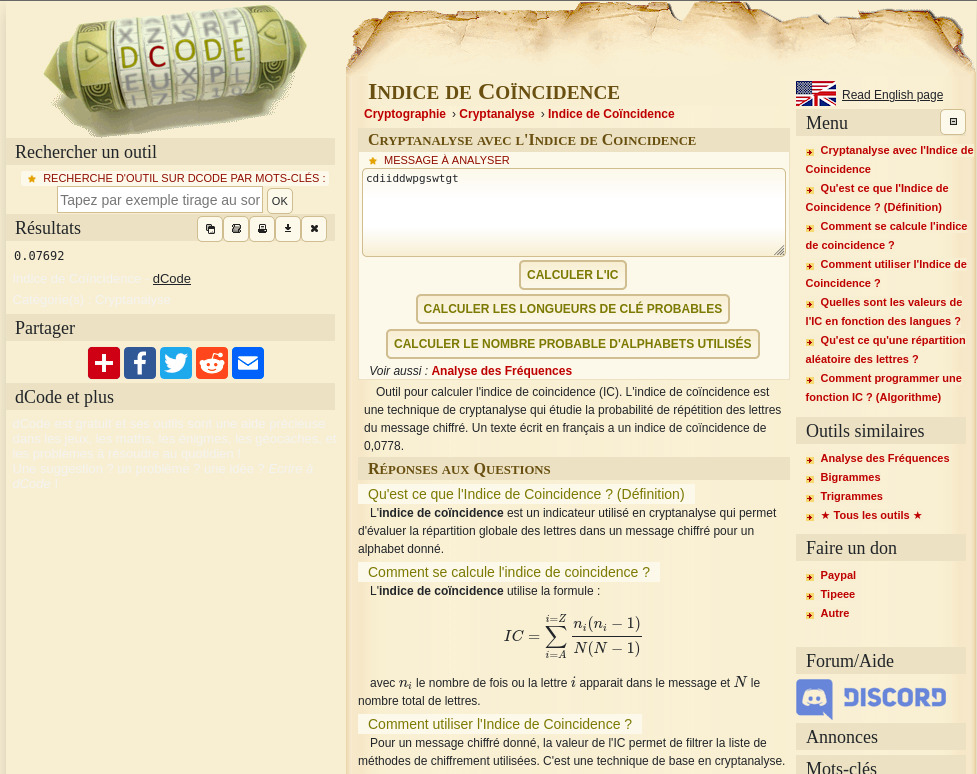
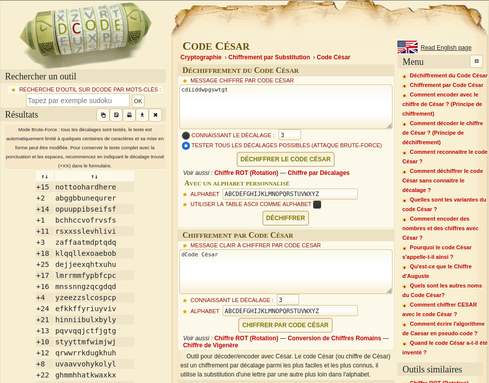

# LEVEL 00

## Vulnerability & exploit

Weak ciphertext -> password decryption

## External resources

<www.dcode.fr>

## Initial Context

Our home directory is empty.\
However, we are given a hint: to look for files belonging to user flag00.

## Solving the challenge

Find flags owned by flag00.  
We can redirect errors to /dev/null to unclutter the output.

```
level00@SnowCrash:~$ find / -user flag00 2>/dev/null
/usr/sbin/john
/rofs/usr/sbin/john
```

If we display the content of these two files, we get a seemingly plain text password:

```
level00@SnowCrash:~$ cat `find / -group flag00 2>/dev/null`
cdiiddwpgswtgt
cdiiddwpgswtgt
```

This password does not work for flag00 nor level01... maybe it's encrypted?  
Let's head to dcode.fr, to see if cryptography tools can help decode the password.

If we check the "indice de coïncidence", we get a value of 0.07692:  


Furthermore, the website provides an analysis of this value:

> Si l'indice de coincidence est grand (proche de 0.070), c'est à dire similaire à celui d'un message non chiffré,
> alors le message a probablement subit une transposition (lettres déplacées)
> ou substitution monoalphabetique (une même lettre ne peut être remplacée que par une seule autre).

We are lacking information to reverse the password with most transposition and monoalphabetic encryption.  
Attempt to use the site's brute-force password decryption yields no obviously correct result.

Heading to the tool for Ceasar encryption (commonly known as rot), we can try all rotations:  


The result when the password is submitted to a rotation of 15 characters is suspiciously well-worded.

Log in as flag00 with password `nottohardhere` and run getflag to get the token for level01.
