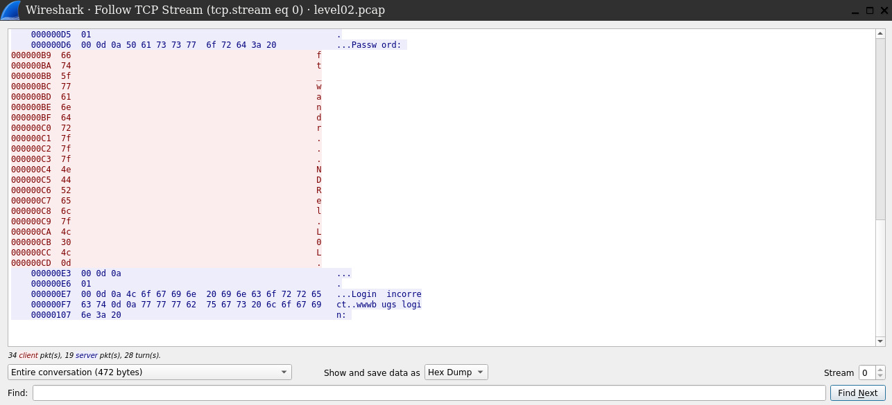

# LEVEL 02

## Vulnerability & exploit

Packets captured over clear text protocol -> password sniffing

## External resources

Wireshark

## Initial Context

In our home directory, we see a .pcap file, which contains packet data captured over a network.

## Solving the challenge

If we naïvely cat the file's content, we can see that it contains what seems to be a password prompt.

Let's further analyze the packet data with Wireshark.
First, we have to download the file:

```
[snowcrash@docker] ~/level02/Ressources # scp -P 4242 scp://level02@192.168.0.169/level02.pcap level02.pcap
level02.pcap    100% 8302    10.1MB/s   00:00
```

Current rights are insufficient to run level02.pcap with Wireshark, so let's give all users the right to read, write and execute.

```
[snowcrash@docker] ~/level02/Ressources # ls -la level02.pcap
----r--r-- 1 snowcrash snowcrash 8302 Oct 19 01:18 level02.pcap
[snowcrash@docker] ~/level02/Ressources # chmod a+rwx level02.pcap && ls -la level02.pcap
-rwxrwxrwx 1 snowcrash snowcrash 8302 Oct 19 01:18 level02.pcap
```

Make sure the wireshark service is running (cf project's README) and head to your browser on `https://localhost:14500/`
You will have to enter a username (of your choice) and a password ("wireshark").

If you open the level02.pcap file, you will see a stream of packets:  


What we would like is to see the content of these packets, in the same order the network received them.
For this, we can analyze the data further by following the TCP stream.
This was inspired by the official [Q&A](https://osqa-ask.wireshark.org/questions/25682/unable-to-capture-passwords-with-wireshark) and [doc](https://www.wireshark.org/docs/wsug_html_chunked/ChAdvFollowStreamSection.html) and

We can now see all the characters entered by the user after the password prompt. However, 4 characters are ".", i.e. not printable in ASCII.  


Let's display the hexdump:  


We can see that four non-printable characters are "7f" and the last one is "0d":

```
Oct   Dec   Hex   Char                        Oct   Dec   Hex   Char
────────────────────────────────────────────────────────────────────────
015   13    0D    CR  '\r' (carriage ret)     115   77    4D    M
077   63    3F    ?                           177   127   7F    DEL
```

So from the data `ft_wandr...NDRel.LOL.`, we should ignore the last character (carriage return) and remove characters deleted by the user:
=> `ft_waNDRELOL` is the password.
We can log in as flag02 and run `getflag` to get the token to proceed to level03.
